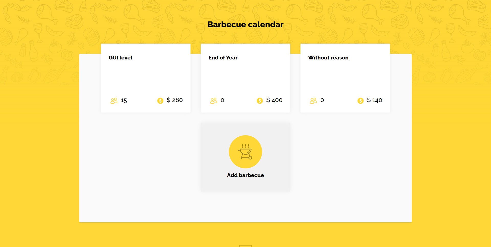

<!-- PROJECT SHIELDS -->

:bangbang: Documentation available to access at: https://nitaicharan.github.io/Trinca-Challenge1 :bangbang:

<!---->
<a href="https://nitaicharan.github.io/Trinca-Challenge2">
  

    
  

</a>

## About the project

This project was part of the Trinca challenge "Churras Trinca".

### Description

You may know that Trinca's guys are use to have barbecues without justification, on random days.
Therefore, we propose the small challenge of putting together a solution to manage these barbecues where it should be possible: https://tinyurl.com/y6arsz4s
- Include a new barbecue with additional date, description and observations;
- Add and remove participants (by entering your contribution amount);
- Insert a suggested amount per contribution user (amount with and without drink included);
- View the details of the barbecue, total participants and amount collected.

### Requisitos de framework

To help you, we've created a prototype that you can use (or not) to design your solution:
- Backend: WebAPI with NodeJS
- Frontend: Frontend in ReactJS
- Design and architecture patterns are free to choose.

## Contact

[![Gmail][gmail-shield]][gmail-url]
[![LinkedIn][linkedin-shield]][linkedin-url]
[![Github][github-shield]][github-url]
[![Udemy][udemy-shield]][udemy-url]
[![Instagram][instagram-shield]][instagram-url]
[![Twitter][twitter-shield]][twitter-url]

<!-- ALIAS README -->

[course-url]: #
[instructor-url]: #
[certificate-url]: #

<!-- CONTACT SHIELDS -->

[linkedin-shield]: https://img.shields.io/badge/-LinkedIn-white.svg?logo=linkedin&colorB=0077B5&logoColor=white
[linkedin-url]: https://linkedin.com/in/nitaicharan/
[gmail-shield]: https://img.shields.io/badge/-Gmail-black.svg?logo=gmail&colorB=D14836&logoColor=white
[gmail-url]: mailto:niaicharan@gmail.com?subject=It%20comes%20from%20Github%20profile
[github-shield]: https://img.shields.io/badge/-Github-black.svg?logo=github&colorB=181717&logoColor=white
[github-url]: https://github.com/nitaicharan
[instagram-shield]: https://img.shields.io/badge/-Instagram-black.svg?logo=instagram&colorB=EC5252&logoColor=white
[instagram-url]: https://instagram.com/nitaicharan/?hl=pt-br
[twitter-shield]: https://img.shields.io/badge/-Twitter-black.svg?logo=twitter&colorB=1DA1F2&logoColor=white
[twitter-url]: https://twitter.com/nitaicharan1
[facebook-shield]: https://img.shields.io/badge/-Facebook-black.svg?logo=facebook&colorB=4172B8&logoColor=white
[facebook-url]: https://facebook.com/NitaiCharan1
[udemy-shield]: https://img.shields.io/badge/-Udemy-black.svg?logo=udemy&colorB=EC5252&logoColor=white
[udemy-url]: https://udemy.com/user/nitai-charan/
[hackerrank-shield]: https://img.shields.io/badge/-HackerRank-white.svg?logo=hackerrank&colorB=2EC866&logoColor=white
[hackerrank-url]: https://hackerrank.com/nitaicharan

<!-- PROJECT SHIELDS -->

[html5-shield]: https://img.shields.io/badge/-HTML5-black.svg?logo=html5&colorB=E34F26&logoColor=white
[css3-shield]: https://img.shields.io/badge/-CSS3-black.svg?logo=css3&colorB=1572B6&logoColor=white
[sass-shield]: https://img.shields.io/badge/-SASS-black.svg?logo=sass&colorB=CC6699&logoColor=white
[angular-shield]: https://img.shields.io/badge/-Angular-black.svg?logo=angular&colorB=DD0031&logoColor=white
[java-shield]: https://img.shields.io/badge/-Java-black.svg?logoColor=white&logo=java&&colorB=007396
[typescript-shield]: https://img.shields.io/badge/-TypeScript-black.svg?logoColor=white&logo=typescript&&colorB=007ACC
[jquery-shield]: https://img.shields.io/badge/-jQuery-white.svg?logo=jquery&colorB=0769AD&logoColor=white
[spring-shield]: https://img.shields.io/badge/-Spring-white.svg?logo=spring&colorB=6DB33F&logoColor=white
[flutter-shield]: https://img.shields.io/badge/-Flutter-white.svg?logo=flutter&logoColor=white&colorB=02569B
[android-shield]: https://img.shields.io/badge/-Android-white.svg?logo=android&logoColor=white&colorB=3DDC84
[apple-shield]: https://img.shields.io/badge/-Apple-white.svg?logo=apple&logoColor=white&colorB=999999
[bootstrap-shield]:https://img.shields.io/badge/-Bootstrap-white.svg?logo=bootstrap&logoColor=white&colorB=563D7C
[react-shield]:https://img.shields.io/badge/-React-white.svg?logo=react&logoColor=white&colorB=61DAFB
[javascript-shield]:https://img.shields.io/badge/-JavaScript-white.svg?logo=javascript&logoColor=black&colorB=F7DF1E
[nodejs-shield]:https://img.shields.io/badge/-Node.js-white.svg?logo=node.js&logoColor=white&colorB=339933